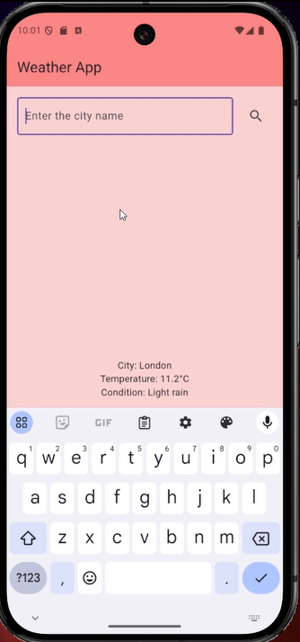
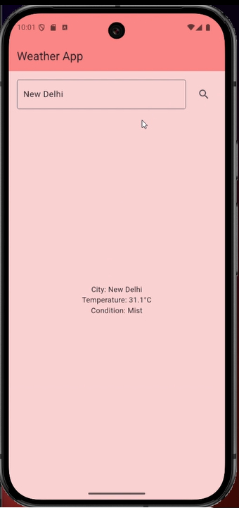
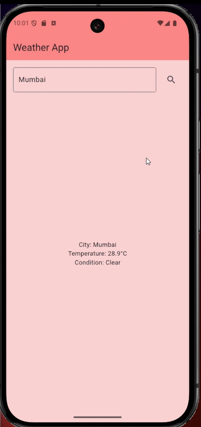

# Weather App Using Riverpod

A Flutter application that provides weather information using Riverpod for state management. The app allows users to check the weather of any city by entering the city name, and it fetches the data from a weather API.

## Features

- Get current weather details (temperature, humidity, weather description) for a city.
- Built using **Riverpod** for state management.
- Fetches weather data from a public **Weather API** (e.g., OpenWeatherMap API).
- User-friendly interface with easy navigation.


## App Screenshots

<div style="display: flex; justify-content: space-between; margin-bottom: 20px;">
  
  
  
</div>

## Getting Started

These instructions will help you set up and run the project locally.

### Prerequisites

1. **Flutter**: You need to have [Flutter](https://flutter.dev/docs/get-started/install) installed.
2. **Riverpod**: The app uses [Riverpod](https://pub.dev/packages/riverpod) for state management. It’s included in the dependencies.

### Installation

1. Clone the repository to your local machine:

   ```bash
   git clone https://github.com/swatirank/Weather-App-Using-Riverpod.git

